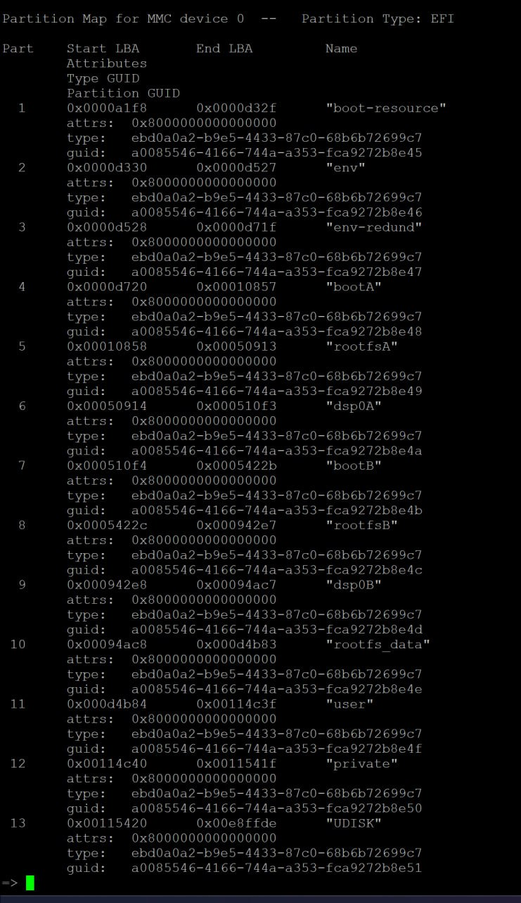

## Anycubic Kobra 2 Series Tools

This repository contains tools for the Anycubic Kobra 2 Series 3D printers.

> [!WARNING]
> This repository is unmaintained. I'm not using the printer anymore and I don't have the time to maintain it. I'm archiving this repository and will delete it in 1 year. So if you want to use it, you need to fork it and maintain it yourself. Same goes for the firmware repository.

### Documentation

Documentation can be found in the `docs` directory.

- [VERSIONS.md](docs/VERSIONS.md) - Known firmware versions.
- [LINKS.md](docs/LINKS.md) - Useful things/addons for the printer.
- [OPTIONS.md](docs/OPTIONS.md) - Options for the firmware.
- [GCODE_COMMANDS.md](docs/GCODE_COMMANDS.md) - GCODE commands.
- [MQTT_API.md](docs/MQTT_API.md) - MQTT API.
- [COMMANDS.md](docs/COMMANDS.md) - Useful commands.
- [PRINTER_CFG.md](docs/PRINTER_CFG.md) - Printer.cfg things.
- [EMMC_BACKUP.md](docs/EMMC_BACKUP.md) - How to backup the EMMC.
- [EMMC_RESTORE.md](docs/EMMC_RESTORE.md) - How to restore the EMMC.
- [ENTER_FEL_MODE.md](docs/ENTER_FEL_MODE.md) - How to enter FEL mode.
- [DOWNLOAD_SDK.md](docs/DOWNLOAD_SDK.md) - How to download the SDK.
- [OLD_INFO.md](docs/OLD_INFO.md) - Old information.
- [CREDITS.md](docs/CREDITS.md) - Credits.

## Usage

> [!IMPORTANT]
> Please backup all files in `/user` so you don't lose access to anycubic cloud and OTA updates. You can use the [EMMC_BACKUP.md](./EMMC_BACKUP.md) guide to backup the whole system. But backing up `/user` is enough to keep access to anycubic cloud and OTA updates.
>
> You could use `dd` command to backup also.

> [!CAUTION] > **IF YOU DO NOT BACKUP OR DELETE THE FILES IN `/user` YOU WILL LOSE ACCESS TO ANYCUBIC CLOUD AND OTA UPDATES. YOU HAVE BEEN WARNED.**
>
> Everything you do is on **your** own risk. I am **not** responsible for any damage you do to your printer.

> [!IMPORTANT]
> For python scripts to work you need to have installed `python3` and `pip3` and then install the required packages with `pip3 install -r requirements.txt`.

#### 1. Clone the repository.

#### 2. Make sure you have uart cable connected and have downgraded to version `2.3.9` so you can continue with the next steps.

> [!NOTE]
> If not you may not get any uart output at all. To downgrade just put the `2.3.9` version on usb like you always do.

#### 3. Place the `.bin .zip .swu` firmware files in the `FW` directory.

> [!TIP]
> If you don't have firmware files, you can use the script `fwdl.sh <model> <version>` to download in the folder `FW` the version for the printer model you need. The supported models are `K2Pro`, `K2Plus` and `K2Max`. The version is given in the format `X.Y.Z` like `3.0.9`.

#### 4. Run `unpack.sh <update_file>` to unpack the selected firmware update file.

The supported file extensions are `bin`, `zip` and `swu`. The result is in the folder `unpacked`.

#### 5. Modify the options file `options.cfg`.

To select the options you need and run `patch.sh` to patch the firmware files in the `unpacked` folder.

The result is still in the folder `unpacked`. You may manually modify the current state of the files if needed. You can also prepare different configuration files for different needs based on the default file `options.cfg`. The custom configuration file is provided as parameter: `patch.sh <custom_configuration_file>`. If no parameter is provided, the file `options.cfg` will be used.

#### 6. Run `pack.sh` to pack the firmware files from the folder `unpacked`.

The result is the file `update/update.swu`.

At the end, if you selected `ssh` and `root_access` with a password, you will be asked if you want to upload the update automatically through ssh. If your printer has already a custom update (with ssh and root password) you can type `y` and press `enter`. The update will be transferred to the printer, executed and the printer will reboot. Otherwise, press enter to exit and follow the next step for USB update.

#### 7. If your printer is still with the original firmware, you have to make root access first.

Then replace the `/etc/swupdate_public.pem` in the printer with the one from the `RESOURCES` directory or create your own (make a copy first of the original `/etc/swupdate_public.pem` key in case you want to return to the original `ota` updates).

Then apply the newly generated custom software `update/update.swu` by USB update (place the file `update.swu` in the folder `update` on the root of a FAT32 formatted USB disk). If your printer already has custom update installed, then you can directly apply the new update by USB update.

To do all this a little easier you can just use `build.sh` and it will run all the steps for you.

> [!WARNING]
> This repository is a work in progress and may contain bugs or may not work as expected any pull requests are welcome.

> [!NOTE]
> Default password for the root access (custom firmware with UART and SSH) is `toor` but it can be changed in the `options.cfg` file.

> [!IMPORTANT]
> Start the scripts directly by `./script_name.sh <parameters>` to be started by the requested `bash` shell. Shells like `sh` are not compatible at this time.

> [!IMPORTANT]
> Use only FAT32 formatted USB disk and place the file `update.swu` inside a folder `update` created at the root of the USB disk. You don't have to have a 4 GB usb. It can be 64 or 128 GB or more. You only need to format 1 partition to max 4 GB. Then FAT32 will be available.

> [!TIP]
> In order for the auto update upload to work properly, you need to setup in advance the configuration file `auto_install.cfg`. It requires one line of text with the following information:
> `host_ip`,`user_name`,`printer_ip`,`ssh_port`
> Example:
> `192.168.1.234,root,192.168.1.242,22`
>
> Only applies if you have already rooted and installed ssh on the printer.

### Advanced usage

Partition map of the printer:

### Information

**FW** - Place `.bin`, `.zip` or `.swu` firmware files here.

**RESOURCES** - Contains resources for the firmware options.

**TOOLS** - Contains tools to decrypt and encrypt firmware files and more.

**unpacked** - Contains the unpacked firmware files.

**update** - Contains the packed firmware files.
